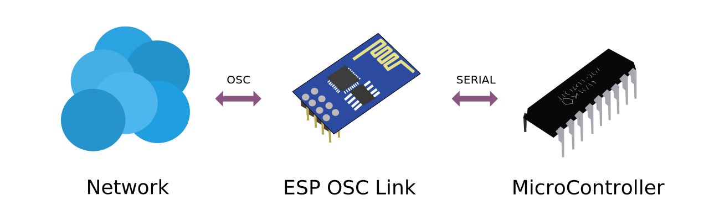

# ESP OSC Link
ESP8266 Open Sound Control (OSC) Uplink for Microcontrollers.

## Setup
The idea of this software is to provide a simple uplink for non-network microcontrollers, to be capable of sending and receiving OSC data.

## Functions
- Connect to WIFI (with credentials)
- Send OSC Data (`INTEGER`)
- Receive and buffer OSC data
- Poll buffered data
- Interrupt on data received

## Protocol
tbd